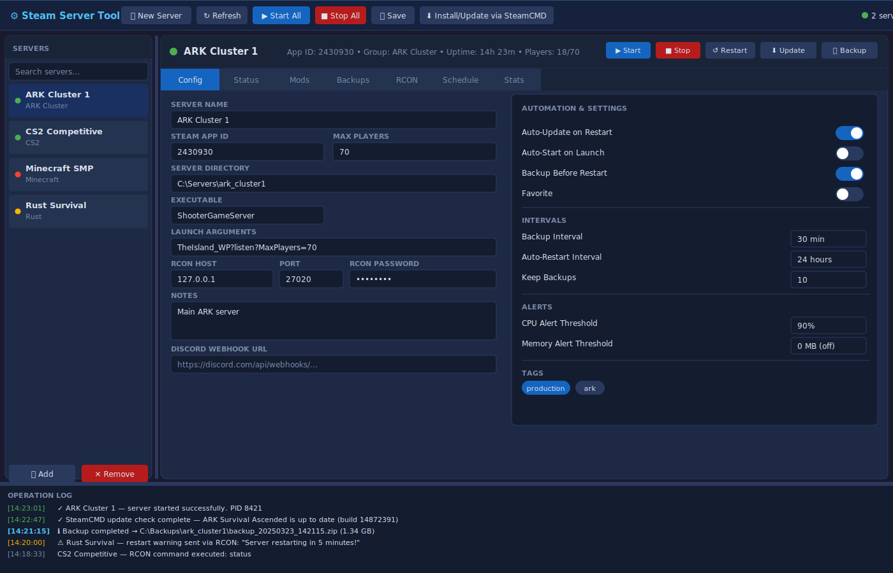

# ⚙ Steam Server Tool

A Windows desktop application (WPF / .NET 9) for managing multiple Steam-powered dedicated game servers from a single, dark-themed dashboard.



---

## ✨ Features

| Category | Details |
|---|---|
| **Server Management** | Add, remove, start, stop, and restart any number of game servers |
| **SteamCMD Integration** | Install and update servers directly via SteamCMD with a single click |
| **Workshop Mod Browser** | Browse and manage Steam Workshop mods for each server |
| **Scheduled Backups** | Automatic backups on a configurable interval; keeps N most-recent archives |
| **Auto-Restart** | Scheduled restarts with configurable pre-restart warning messages via RCON |
| **RCON Console** | Built-in RCON client — send commands and read server output in real time |
| **Discord Webhooks** | Optional per-server webhook notifications for start/stop/crash events |
| **Resource Alerts** | CPU and memory threshold alerts per server |
| **Server Groups & Tags** | Organise servers into named groups and tag them freely |
| **Crash Detection** | Tracks total crashes and last-crash timestamp per server |
| **Uptime Tracking** | Cumulative uptime recorded across restarts |

---

## 🖥 Requirements

- **Windows 10 / 11** (64-bit)
- [**.NET 9 Desktop Runtime**](https://dotnet.microsoft.com/download/dotnet/9.0) or SDK
- [**SteamCMD**](https://developer.valvesoftware.com/wiki/SteamCMD) (optional — only needed for install/update)

---

## 🚀 Getting Started

### Option A — Clone and build

```powershell
git clone https://github.com/shifty81/SteamServerToolLatest.git
cd SteamServerToolLatest

# Build (requires .NET 9 SDK)
dotnet build SteamServerTool.sln

# Run
dotnet run --project SteamServerTool
```

### Option B — Open in Visual Studio

1. Install **Visual Studio 2022** (Community edition is free).
2. Open `SteamServerTool.sln` — all three projects load automatically.
3. Set **SteamServerTool** as the startup project and press **F5**.

> **Tip:** The `.sln` file uses the standard Visual Studio solution format (Format Version 12.00) and is compatible with Visual Studio 2019, 2022, and the `dotnet` CLI.

---

## 📂 Project Structure

```
SteamServerToolLatest/
├── SteamServerTool/           # WPF UI (MainWindow, WorkshopBrowserWindow)
│   └── Themes/DarkTheme.xaml  # Dark colour-palette resource dictionary
├── SteamServerTool.Core/      # Business logic — no UI dependencies
│   ├── Models/                # ServerConfig, RconConfig, WorkshopItem, …
│   └── Services/              # ServerManager, SteamCmdService, BackupService,
│                              #   RconClient, WorkshopService
├── SteamServerTool.Tests/     # xUnit test suite (ServerConfig, ServerManager)
├── Scripts/
│   ├── build.ps1              # PowerShell build helper
│   └── build.sh               # Bash build helper
└── servers.json               # Default server configuration (example)
```

---

## ⚙ Configuration (`servers.json`)

Servers are stored in `servers.json` (next to the executable). The file is created automatically on first run. A minimal example:

```json
[
  {
    "name": "My ARK Server",
    "appId": 2430930,
    "dir": "C:\\Servers\\ark",
    "executable": "ShooterGameServer",
    "launchArgs": "TheIsland_WP?listen?MaxPlayers=20",
    "rcon": { "host": "127.0.0.1", "port": 27020, "password": "changeme" },
    "autoUpdate": true,
    "backupIntervalMinutes": 30,
    "keepBackups": 10,
    "restartIntervalHours": 24
  }
]
```

See [`servers.json`](servers.json) for a full example with all available fields.

---

## 🧪 Running Tests

```powershell
dotnet test SteamServerTool.sln
```

---

## 🗺 Roadmap

- [ ] Per-server CPU / RAM live graphs
- [ ] Tray icon with quick start/stop
- [ ] Windows Service mode (headless)
- [ ] Multi-instance cluster management
- [ ] Plugin / extension API

---

## 🤝 Contributing

Pull requests are welcome! Please open an issue first to discuss significant changes.

1. Fork the repository
2. Create a feature branch (`git checkout -b feature/my-feature`)
3. Commit your changes (`git commit -m "Add my feature"`)
4. Run the test suite to verify nothing is broken (`dotnet test SteamServerTool.sln`)
5. Push to your branch and open a Pull Request

---

## 📄 License

This project is open source. See [LICENSE](LICENSE) for details (if not present, assume MIT).
